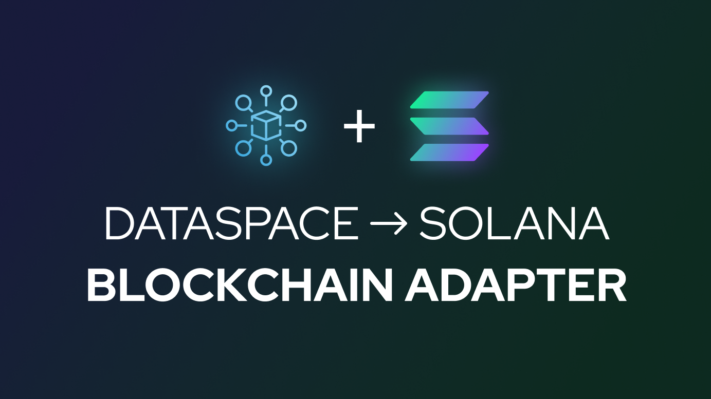
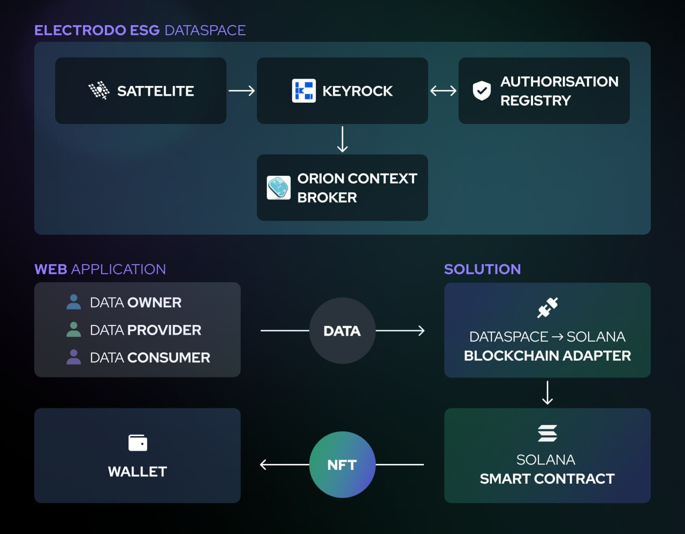

## Description

Our solution is demonstrated from the perspective of an ESG manager at AgriFi International. The ESG manager is responsible for creating,submitting and sharing the company's ESG report.

AgriFi International ESG manager uses the option of notarizing the report on the Solana blockchain to achieve transparency, traceability and immutability of the reporting process, which consequently leads to trust between potential investors and companies. This is done by creating an NFT on the Solana blockchain, the metadata of which contains a link to the AgriFi International ESG report submitted in IPFS.



Here's how it works:
The manager logs into their Dashboard in Electrodo via Keyrock (ESG Data Space building block, which is responsible for user authorization).
Once a manager has access to their dashboard, he or she can fill in the AgriFi International ESG report with relevant data.
After filling out the report, the manager specifies the beneficiary address in the Solana blockchain in a separate field where they would like to  receive the tokenized report.
The manager clicks the "Tokenize report" button and Electrodo backend creates a PDF file of the report, then sends it to Pinata IPFS and receives a link to the uploaded file.
The backend then mints the NFT. The metadata of the NFT contains a link to the report file.

Now, potential investors can verify the date the report was submitted, the author of the report, and be confident that the report has not been changed.


## Installation

```bash
$ yarn install
```

## Running the app

```bash
# development
$ yarn run start

# watch mode
$ yarn run start:dev

# production mode
$ yarn run start:prod
```

## Test

```bash
# unit tests
$ yarn run test

# e2e tests
$ yarn run test:e2e

# test coverage
$ yarn run test:cov
```

## Support

Nest is an MIT-licensed open source project. It can grow thanks to the sponsors and support by the amazing backers. If you'd like to join them, please [read more here](https://docs.nestjs.com/support).

## Stay in touch

- Author - [Kamil Myśliwiec](https://kamilmysliwiec.com)
- Website - [https://nestjs.com](https://nestjs.com/)
- Twitter - [@nestframework](https://twitter.com/nestframework)

## License

Nest is [MIT licensed](LICENSE).
